# book-a-week
Reading one dev-related book every week

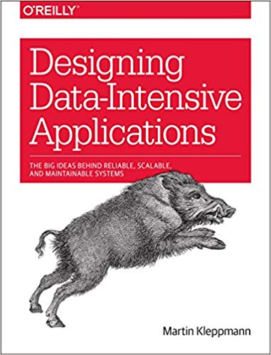
 
*16.03.2019*

**Высоконагруженные приложения\
Программирование масштабирование поддержка**

Мартин Клеппман
 
**Designing Data-Intensive Applications:\
The Big Ideas Behind Reliable, Scalable, and Maintainable Systems**

Martin Kleppmann 
 
---

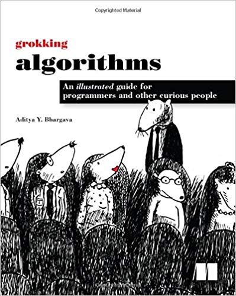

*23.03.2019*

**Грокаем алгоритмы\
Иллюстрированное пособие для программистов и любопытствующих**
 
Адитья Бхаргава

**Grokking Algorithms\
An illustrated guide for programmers and other curious people**

Aditya Bhargava
 
---

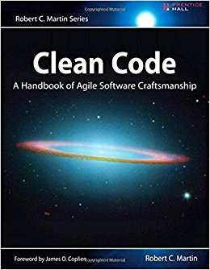

*31.03.2019*

**Чистый код\
Создание, анализ и рефакторинг**
 
Роберт Мартин

**Clean Code:\
A Handbook of Agile Software Craftsmanship**

Robert C. Martin
 
---

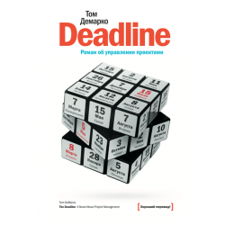

*07.04.2019*

**Deadline\
Роман об управлением проектами**
 
Том Демарко

**The Deadline\
 A novel about project management**

Tom DeMarco
 
---

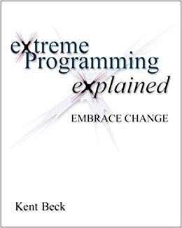

*14.04.2019*

**Экстремальное программирование**
 
Кент Бек

**Extreme Programming Explained:\
 Embrace Change**

Kent Beck
 
---

*21.04.2019*

**Джедайские техники:\
Как воспитать свою обезьяну, опустошить инбокс и сберечь мыслетопливо**

Максим Дорофеев

  

---

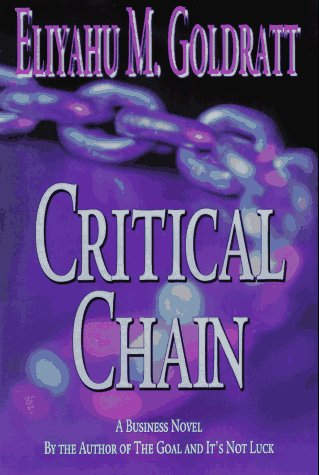

*28.04.2019*

**Критическая цепь**
 
Элияху Голдратт

**Critical Chain**

Eliyahu M. Goldratt
 
---

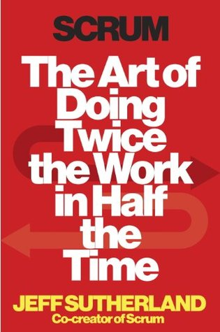

*05.05.2019*

**Scrum\
Революционный метод управления проектами**
 
Джефф Сазерленд

**Scrum:\
 The Art of Doing Twice the Work in Half the Time**

Jeff Sutherland
 
---

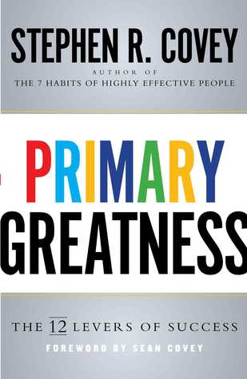

*12.05.2019*

**Быть, а не казаться\
Размышления об истинном успехе**
 
Стивен Кови

**Primary Greatness:\
The 12 Levers of Success**

Covey Stephen
 
---

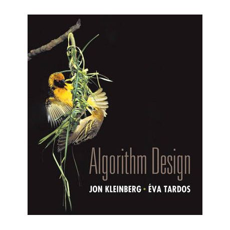

*19.05.2019*

**Алгоритмы\
Разработка и применение**

Дж. Клейнберг, Е. Тардос 

**Algorithm design**

Jon Kleinberg, Eva Tardos

---

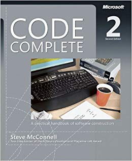

*26.05.2019*

**Совершенный код\
Практическое руководство по разработке программного обеспечения**

Стив Макконнелл

**Code Complete:\
A Practical Handbook of Software Construction**

Steve McConnell

---

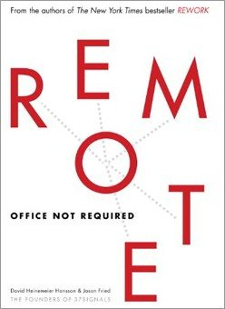

*02.06.2019*

**Remote\
Офис не обязателен**

Фрайд Джейсон, Ханссон Дэвид Хейнмейер

**REMOTE:\
Office Not Required**

Jason Fried, David Heinemeier Hansson

---

*09.06.2019*

**Карьера программиста.\
Как устроиться на работу в Google, Microsoft или другую ведущую IT-компанию**

Макдауэлл Г. Лакман

**Cracking the Coding Interview:\
150 Programming Interview Questions and Solution**

Gayle Laakmann McDowell

---

*16.06.2019*

**Nudge\
Архитектура выбора**

Ричард Талер, Касс Санстейн

**Nudge\
Improving Decisions About Health, Wealth, and Happiness**

Richard H. Thaler, Cass R. Sunstein

---

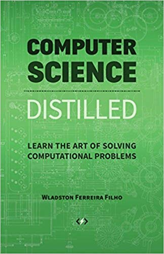

*23.06.2019*

**Теоретический минимум по Computer Science.\
Все что нужно программисту и разработчику**

Фило Феррейра

**Computer Science Distilled.\
Learn the Art of Solving Computational Problems**

Wladston Ferreira Filho

---
